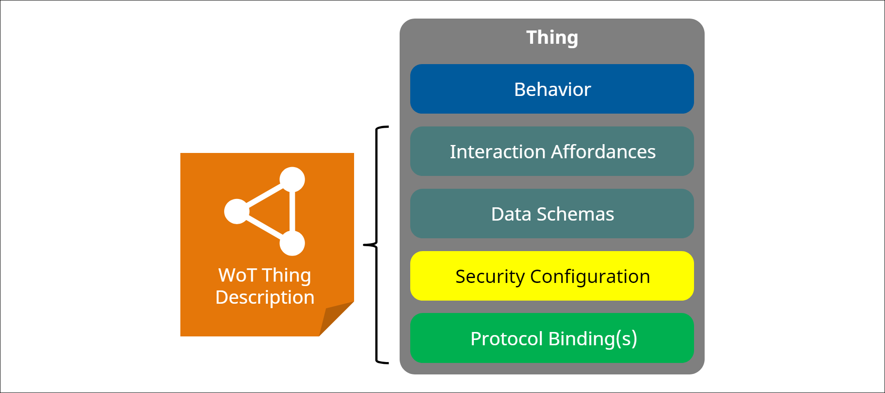
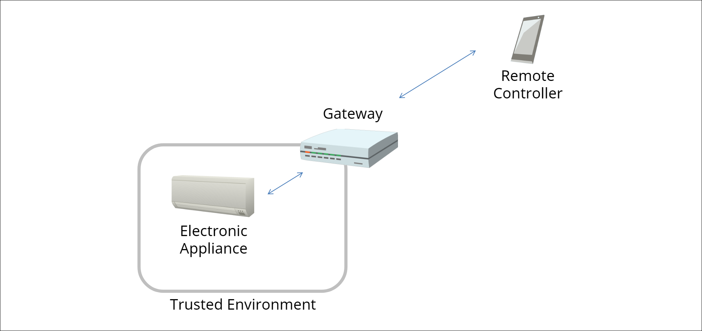
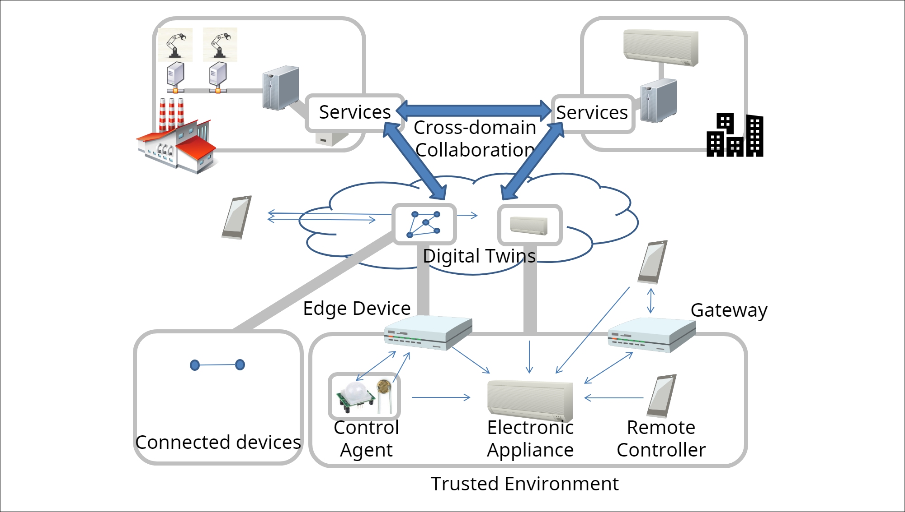

# WebThings Gateway

- ## Documentation

- [W3C Web of Things (WoT) Thing Description](https://w3c.github.io/wot-thing-description/)
- [W3C Web of Things (WoT) Architecture](https://w3c.github.io/wot-architecture)
- [WoT Capability Schemas](https://webthings.io/schemas)

- ## Thing Description

Web of Thing(WOT) Description,主要是通过数据对现实生活中物理设备的描述(以下例子给合Golang struct为例)。
通过这种语义描述，处于不同网络位置的设备就能相互通讯，从而我们能让物联网设备按设想好的方式完成自动化的交互。

#### Thing Description(TD)是对一个具休设备或者一组行为的通用描述。



#### DataSchemas：TD中参数和数据的基本结构。

```golang
type DataSchema struct {
AtType           string        `json:"@type,omitempty"`
Title            string        `json:"title"`
Titles           []string      `json:"titles,omitempty"`
Description      string        `json:"description,omitempty"`
Descriptions     []string      `json:"descriptions,omitempty"`
Unit             string        `json:"unit,omitempty"`
Const            interface{}   `json:"const,omitempty"`
OneOf            []DataSchema  `json:"oneOf,,omitempty"`
Enum             []interface{} `json:"enum,omitempty"`
ReadOnly         bool          `json:"readOnly,omitempty"`
WriteOnly        bool          `json:"writeOnly,omitempty"`
Format           string        `json:"format,omitempty"`
ContentEncoding  string        `json:"contentEncoding,,omitempty"`
ContentMediaType string        `json:"contentMediaType,,omitempty"`

Type string `json:"type"`
}
```

#### Interaction Affordances：TD中某一类交互行为的描述。

```go
type InteractionAffordance struct {
AtType       string                 `json:"@type"`
Title        string                 `json:"title,omitempty"`
Titles       map[string]string      `json:"titles,omitempty"`
Description  string                 `json:"description,omitempty"`
Descriptions map[string]string      `json:"descriptions,omitempty"`
Forms        []Form                 `json:"forms,omitempty"`
UriVariables map[string]IDataSchema `json:"uriVariables,omitempty"`
}

```

#### 以下以灯泡为例，做说明



- 灯泡有亮度、颜色、开关等各种参数和能改变这些参数的行为，可把这一类称为设备的属性(Property)。 于是一个设备有如下数据结构：

```golang
type PropertyAffordance struct {
InteractionAffordance
DataSchema
Observable bool `json:"observable"`
}


```

- 序列化的Property基本表示(这个灯有一个名为BrightnessProperty的integer属性，可向 "/things/lamp/properties/brightness"提交0-100间的integer来改变亮度)。

```json
{
  "brightness": {
    "@type": "BrightnessProperty",
    "type": "integer",
    "title": "Brightness",
    "description": "The level of light from 0-100",
    "minimum": 0,
    "maximum": 100,
    "forms": [
      {
        "href": "/things/lamp/properties/brightness"
      }
    ]
  }
}
```

- Action为灯光一组行为的描述,比如需要让这个灯泡规律性的闪烁，这时就需要有Input参数了。

```go
type ActionAffordance struct {
*InteractionAffordance
Input      IDataSchema `json:"input,omitempty"`
Output     IDataSchema `json:"output,omitempty"`
Safe       bool        `json:"safe,omitempty"`
Idempotent bool        `json:"idempotent,omitempty"`
}
```

- 序列化的基本表示(这个灯光具有渐变的行为，并且接受0-100间的integer做参数，可向"/things/lamp/actions/fade"提交表单数据的方式调用)。

```json
{
  "fade": {
    "@type": "FadeAction",
    "title": "Fade",
    "description": "Fade the lamp to a given level",
    "input": {
      "type": "object",
      "properties": {
        "level": {
          "type": "integer",
          "minimum": 0,
          "maximum": 100
        },
        "duration": {
          "type": "integer",
          "minimum": 0,
          "unit": "milliseconds"
        }
      }
    },
    "froms": [
      {
        "href": "/things/lamp/actions/fade"
      }
    ]
  }
}
```

-  完整的

```json
{
  "@context": "https://webthings.io/schemas/",
  "@type": [
    "Light",
    "OnOffSwitch"
  ],
  "id": "https://mywebthingserver.com/things/lamp",
  "title": "My Lamp",
  "description": "A web connected lamp",
  "properties": {
    "on": {
      "@type": "OnOffProperty",
      "type": "boolean",
      "title": "On/Off",
      "description": "Whether the lamp is turned on",
      "links": [
        {
          "href": "/things/lamp/properties/on"
        }
      ]
    },
    "brightness": {
      "@type": "BrightnessProperty",
      "type": "integer",
      "title": "Brightness",
      "description": "The level of light from 0-100",
      "minimum": 0,
      "maximum": 100,
      "links": [
        {
          "href": "/things/lamp/properties/brightness"
        }
      ]
    }
  },
  "actions": {
    "fade": {
      "@type": "FadeAction",
      "title": "Fade",
      "description": "Fade the lamp to a given level",
      "input": {
        "type": "object",
        "properties": {
          "level": {
            "type": "integer",
            "minimum": 0,
            "maximum": 100
          },
          "duration": {
            "type": "integer",
            "minimum": 0,
            "unit": "milliseconds"
          }
        }
      },
      "links": [
        {
          "href": "/things/lamp/actions/fade"
        }
      ]
    }
  },
  "events": {
    "overheated": {
      "title": "Overheated",
      "@type": "OverheatedEvent",
      "type": "number",
      "unit": "degree celsius",
      "description": "The lamp has exceeded its safe operating temperature",
      "links": [
        {
          "href": "/things/lamp/events/overheated"
        }
      ]
    }
  },
  "links": [
    {
      "rel": "properties",
      "href": "/things/lamp/properties"
    },
    {
      "rel": "actions",
      "href": "/things/lamp/actions"
    },
    {
      "rel": "events",
      "href": "/things/lamp/events"
    },
    {
      "rel": "alternate",
      "href": "wss://mywebthingserver.com/things/lamp"
    },
    {
      "rel": "alternate",
      "mediaType": "text/html",
      "href": "/things/lamp"
    }
  ]
}
```

- ## Web Thing Gateway
Web Thing Gateway的目标，通过把不同协议的设备，转换成WOT的数据模式，来达到物与物，物与人之间的交互。
Gateway的设备接入层，用到了类似Chrome浏览器的插件系统，插件完成不同设备不同协议向WOT间的转换。



