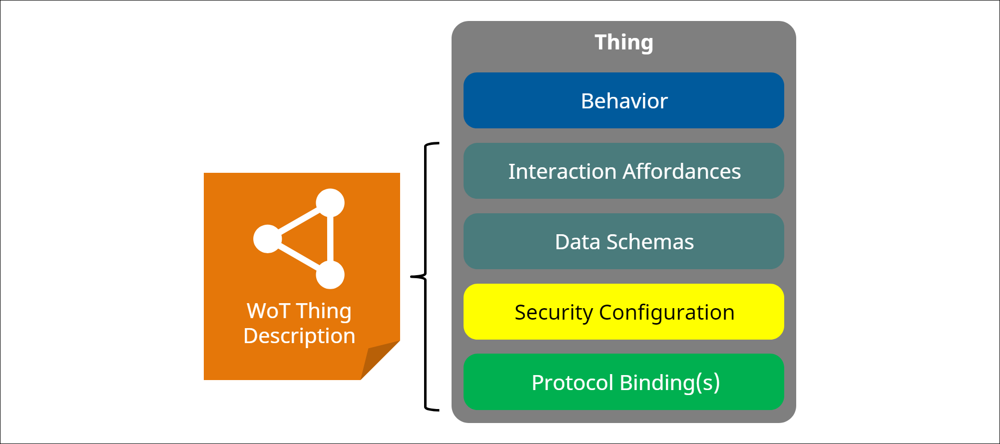
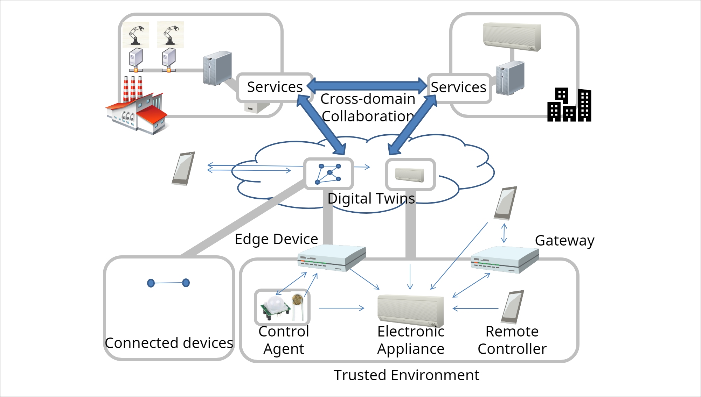

# WebThings Gateway

- ## Architectural Aspects of a Thing



- ## Web Thing Gateway




- ## Thing Description (JSON)

```json
{
  "@context": [
    "https://webthings.io/schemas"
  ],
  "title": "Light192.168.0.104",
  "id": "Light192.168.0.104",
  "@type": [
    "Light"
  ],
  "properties": {
    "hue": {
      "@type": "ColorProperty",
      "title": "Hue",
      "forms": [
        {
          "href": "/things/Light192.168.0.104/properties/hue"
        }
      ],
      "type": "string",
      "observable": false
    },
    "level": {
      "@type": "BrightnessProperty",
      "title": "Brightness",
      "forms": [
        {
          "href": "/things/Light192.168.0.104/properties/level"
        }
      ],
      "unit": "percent",
      "type": "integer",
      "minimum": 0,
      "maximum": 100,
      "observable": false
    },
    "on": {
      "@type": "OnOffProperty",
      "title": "On/Off",
      "forms": [
        {
          "href": "/things/Light192.168.0.104/properties/on"
        }
      ],
      "type": "boolean",
      "observable": false
    }
  },
  "forms": [
    {
      "href": "/things/Light192.168.0.104/properties",
      "contentType": "application/json",
      "op": [
        "readAllProperties",
        "writeAllProperties"
      ]
    }
  ],
  "selectedCapability": "Light",
  "connected": false
}
```